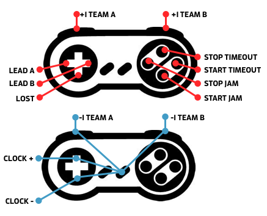

# Scorehub

Scorehub is connects [CRG Scoreboard](https://www.facebook.com/groups/derbyscoreboard/) with some gadgets. 

### Gamepad

Thanks to [node-gamepad](https://www.npmjs.com/package/gamepad) many cheap usb-gamepads can be used. Tested with [this one](https://www.amazon.de/dp/B01EA7MVUU/).



### Counterclock

[CounterClock](https://github.com/yetzt/counterclock), an Arduino/ESP8266-based Jam Timing device, is supported.

## Setup

This will become nicer, but for now...

You will need to have git and [node.js](https://nodejs.org/) up and running.

### Install

```
git clone https://github.com/yetzt/scorehub.git;
cd scorehub;
npm install;
```

### Run

```
DEBUG=* node scorehub/scorehub.js;
```

## Todo

* Rapid fire key press for clock adjustment (maybe)
* Keep and maintain roster state for jammer/pivot selection (find out how to)
* Keypad for jammer/pivot selection (if possible with node-hid)
* Server for counterclock

